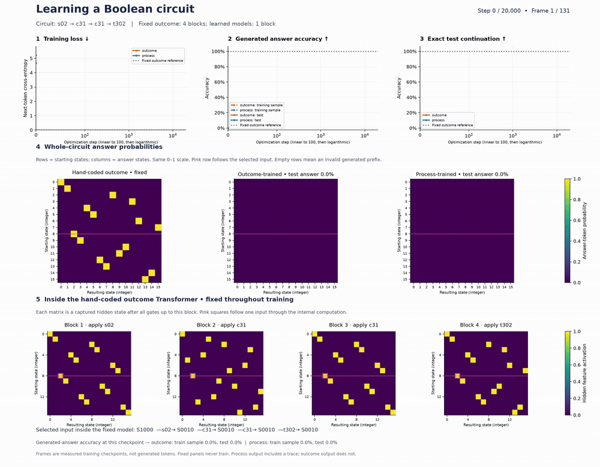

# Trace: learning to compute with reasoning traces

How does supervision on intermediate steps change what an autoregressive Transformer learns?

Trace explores this question with synthetic tasks whose computations can be checked exactly: Boolean circuits, finite-state machines, register machines, and other sequential problems. Models learn either a final answer or a sequence of intermediate states followed by that answer. Reliability sweeps also vary whether the supervised trace is correct while keeping the terminal answer correct.

Start with **[the Boolean-circuit tutorial](handcoded.ipynb)** for an illustrated, executable introduction. Use the command-line experiments below for comparisons across tasks, seeds, and trace reliability.

## Watch the experiment

[](training_dynamics.mp4)

**[Watch or download the full-resolution MP4](training_dynamics.mp4)** · **[Download the interactive HTML player](training_dynamics.html)** · **[Open the notebook](handcoded.ipynb)**

The GIF is a compact preview of the exported video. Download the HTML file and open it in a browser for playback controls and a checkpoint slider; the repository's file viewer does not execute the player.

The animation shows:

- **Training curves:** next-token training loss, generated-answer accuracy on a training sample and the test set, and exact test-continuation accuracy.
- **Whole-circuit answer matrices:** one selected gate sequence evaluated from all 16 initial states. Rows are starting states; columns are final-state tokens. The process model generates its own trace before predicting the answer.
- **Inside the hand-coded outcome model:** hidden state features captured after each block. These show cumulative execution of the selected circuit and remain fixed during training.

Orange denotes the learned outcome model, blue the learned process model, and purple the fixed outcome reference. The pink highlight follows one starting state. Frames advance through **measured optimization checkpoints**, not generated tokens. The matrices show model responses and internal activations, not raw attention weights.

## Quick start

Use Python 3.12 or newer and `uv`. From the repository root:

```bash
uv sync
```

For the notebook kernel and optional MP4 export, install these additional packages into the project environment:

```bash
uv pip install --python .venv/bin/python ipykernel imageio-ffmpeg
```

Open [handcoded.ipynb](handcoded.ipynb), select `.venv/bin/python` as its kernel, and run the cells in order. The notebook selects CUDA when available and otherwise uses CPU. It trains small models from scratch; no pretrained model download is needed for this tutorial.

Adjust `TRAIN_SIZE`, `TEST_SIZE`, `STEPS`, and `BATCH_SIZE` in the configuration cell before running. Use a small update budget to check the workflow; use longer runs and multiple seeds to study learning. More checkpoints add evaluation and rendering time.

## The Transformer tutorial

The notebook uses semantic tokens: each four-bit state and each gate is a single token. A circuit example looks like this:

```text
Shared prompt:
S0000 x0 c01 t012 s03 <SEP>

Outcome target:
<COLON> S0111 <EOS>

Process target:
x0 S1000 c01 S1100 t012 S1110 s03 S0111 <COLON> S0111 <EOS>
```

There is no mode token in the prompt. Separate models learn the two continuation formats. These are explicit **symbolic reasoning traces**, not natural-language explanations.

| Model | Architecture | Generated continuation |
|---|---|---|
| Learned outcome | One causal attention layer, four heads, residuals, ReLU MLP, no LayerNorm | Final answer |
| Learned process | Same architecture and initialization as learned outcome | Gate/state trace, then answer |
| Hand-coded process reference | Fixed causal attention and a structured ReLU MLP | Gate/state trace, then answer |
| Hand-coded outcome reference | One fixed attention/MLP block per gate; four blocks at the default depth | Final answer, with intermediate states computed internally |

The learned models share training circuits and minibatch indices. Process continuations contain more target tokens, so equal update counts do not mean equal computation. The fixed references use different capacities from the learned models and serve as constructive examples, not capacity-matched controls.

During **training**, teacher forcing supplies earlier gold continuation tokens. During **generation**, the model chooses the next token from its logits, appends it, and repeats until EOS or the token limit. No Python gate execution or gold-state correction is used during inference. The exact gate functions provide labels and initialize the fixed references' weights.

### Read the metrics correctly

| Notebook metric | Meaning |
|---|---|
| `train_loss` | Next-token cross-entropy on a fixed subset of up to 256 training circuits; not an accuracy percentage |
| `train_answer_accuracy_sample` | Autoregressive answer accuracy on a fixed sample of up to 300 training circuits; not the full training set |
| `test_answer_accuracy` | Autoregressive final-answer accuracy on all test circuits |
| `test_exact_continuation` | Fraction of test outputs matching every expected token; includes the full trace for process models |

Whole-circuit heatmaps retain probabilities from the full vocabulary without renormalizing over states. A dark row can indicate probability assigned to non-state tokens; a generated prefix that does not reach the expected answer delimiter is represented by a zero row. Use the test metrics, rather than brightness alone, to judge task performance.

### Render or export the animation

After training has populated `history` and the fixed-reference data:

```python
training_animation = animate_training_dynamics(
    history,
    fixed_circuit,
    fixed_outcome_comparison,
    interval_ms=140,
    dpi=140,
    figsize=(18, 14),
    selected_start=8,  # Follow S1000 through the fixed circuit.
)

display(export_training_animation(training_animation))
save_training_mp4(training_animation, "training_dynamics.mp4", fps=7, dpi=180)
```

The function returns a Matplotlib `FuncAnimation`. HTML export includes a reading guide; MP4 export uses an explicit FFmpeg writer with the `imageio-ffmpeg` binary when system FFmpeg is unavailable.

Increase `ANIMATION_CHECKPOINTS` before training to record more real frames. Changing playback speed cannot recover missing checkpoints. Set `ANIMATION_GATES` before collecting the circuit matrices to choose another gate sequence. The step axis is linear through 100 and logarithmic afterward to keep early learning visible.

## Run the broader experiments

The scripts use the task registry and the GPT implementation in `src/`. Their tokenization and model configuration differ from the semantic-token, one-layer notebook experiment.

### Compare supervision formats

A small workflow check:

```bash
uv run compare_supervision.py \
  --tasks boolean_circuit_4 \
  --modes outcome answer_first filler process corrupted \
  --seeds 2001 \
  --train-size 1000 --val-size 100 \
  --steps 100 --batch-size 32 --workers 0
```

This script prints per-run loss, answer accuracy, and a summary. Increase the dataset size, training budget, and number of seeds for a substantive comparison.

| Condition | Supervised continuation |
|---|---|
| `outcome` | Answer only |
| `process` | Correct trace before the answer |
| `corrupted` | Incorrect trace before the correct answer |
| `answer_first` | Correct answer before the trace |
| `filler` | Filler tokens before the answer |

### Sweep trace reliability

`rho` controls the probability of assigning a valid trace to a training example. The outcome remains correct even when the trace is corrupted.

```bash
uv run sweep_ratio.py \
  --task boolean_circuit_8 \
  --rhos 0.0 0.5 0.8 1.0 \
  --seeds 2001 2002 2003 \
  --checkpoints 1000 2000 4000 \
  --train-size 20000 --val-size 1000 \
  --batch-size 128 --include-outcome
```

Each condition and seed is trained along one trajectory and evaluated at its checkpoints. The script writes CSV results under `results/` by default. It reuses ratio scores across reliability values, making valid-trace assignments nested. Training and validation prompts are generated without overlap in these command-line comparisons.

### Other entry points

| File | Purpose |
|---|---|
| [mechanism_diagnostics.py](mechanism_diagnostics.py) | More detailed trace, state, and gradient diagnostics |
| [fastexec.py](fastexec.py) | Faster training and cached autoregressive decoding, with self-tests and a benchmark |
| [lora.py](lora.py) | LoRA experiments with pretrained causal language models; separate model and resource requirements |
| [data_cleaning_validation.py](data_cleaning_validation.py) | Data validation utilities |
| [src/registry.py](src/registry.py) | Registered task names and task configurations |
| [src/model.py](src/model.py) | GPT architecture used by the broader scripts |

Inspect supported arguments before running a larger experiment:

```bash
uv run mechanism_diagnostics.py --help
uv run lora.py --help
uv run fastexec.py --selftest
```

List the available tasks:

```bash
uv run python -c "from src.registry import TASKS; print('\n'.join(sorted(TASKS)))"
```

Task families include reversible Boolean circuits, finite-state machines, register machines, modular programs, stack machines, and word-index problems.

## Reproducibility and interpretation

Keep model, data, minibatch, and corruption-assignment seeds explicit. Compare models on the same prompts and preserve per-seed results rather than reporting only averages. In the tutorial, sampled training and test circuits use separate random generators; the notebook does not explicitly filter duplicate prompts across those splits.

The exported animation illustrates one run and one selected circuit. It does not establish that outcome supervision cannot learn, that the observed gap persists across seeds or architectures, or that results transfer to natural-language reasoning. Trace lengths, supervision formats, model capacity, and update budgets matter when interpreting a comparison.

## Repository guide

| Location | Contents |
|---|---|
| [handcoded.ipynb](handcoded.ipynb) | Main Transformer tutorial, fixed references, training, generation, and animation |
| [pending_identifiability_experiments.ipynb](pending_identifiability_experiments.ipynb), [pending_transformer_fast.ipynb](pending_transformer_fast.ipynb) | Additional experiment notebooks |
| [trace.ipynb](trace.ipynb), [train_seed.ipynb](train_seed.ipynb), [verify_experiments1-5.ipynb](verify_experiments1-5.ipynb) | Further training and verification notebooks |
| `src/` | Models, tokenizers, task generators, and utilities |
| [pyproject.toml](pyproject.toml), [uv.lock](uv.lock) | Project dependencies and environment lockfile |
| `results/` | Local experiment outputs |
| [training_dynamics.mp4](training_dynamics.mp4), [training_dynamics.html](training_dynamics.html) | Exported animation |
| [docs/assets/training-dynamics.gif](docs/assets/training-dynamics.gif) | Compact animated README preview |
