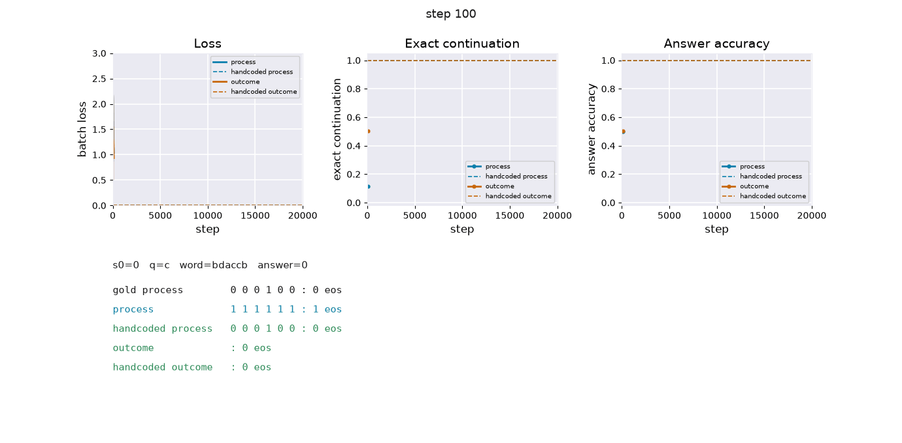

# trace

Process supervision versus outcome supervision. Same Transformer, two losses.



```bash
uv sync
uv run python handcoded/lettertrace.py task=count word_len=6 mod=2 steps=8000
```

`bash run.sh` does the same thing. The notebook `handcoded/lettertrace_train.ipynb` trains both losses from one initialization and writes the gif.

Counting code is in `handcoded/`. Boolean circuits, the register machine, the state machine, and LoRA are in `src/`. Other paper commands are in [RUN.md](RUN.md).
